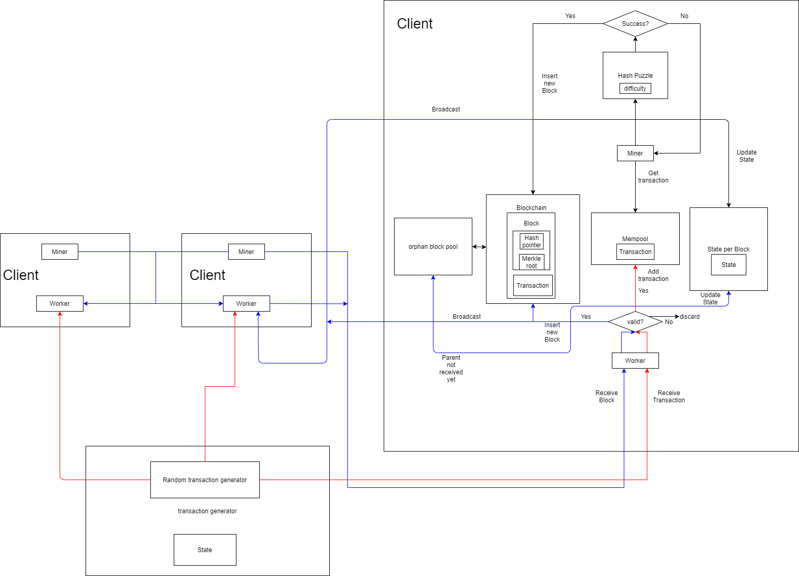

## Start a client
    cargo run -- -vvv --p2p 127.0.0.1:6000 --api 127.0.0.1:7000
## Connect two clients
    cargo run -- -vvv --p2p 127.0.0.1:6001 --api 127.0.0.1:7001 -c 127.0.0.1:6000
#### --p2p parameter means that the first process will listen on 127.0.0.1:6000 and the second process will listen on 127.0.0.1:6001.
#### -c parameter means that the second process will try to connect to 127.0.0.1:6000, which is the address of the first process.
#### --api parameter means that the process will listen on this port for mining command.
## Start mining
    In a browser (or curl command), go to 
    http://127.0.0.1:7000/miner/start?lambda=1000000 and 
    http://127.0.0.1:7001/miner/start?lambda=1000000 
    to start mining.
## Design graph
